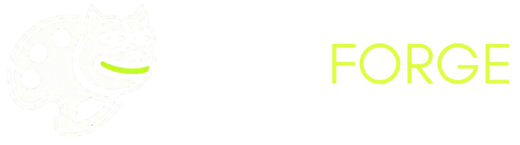

  
   
   

  
<b>All-in-one dev tool for memecoin and token developers</b>

  
<i>Built for the Bags.fm Hackathon</i>

  

    
    
    
    
  

---

## Overview

MemeForge is a web platform designed to help memecoin and token developers centralize their content generation. It combines a visual editing suite, a multi-platform feed scraper for trend research, and automated context generation into a single dashboard. 

The goal of this project is to simplify the process of maintaining a consistent digital brand while keeping up with fast-moving internet trends.

## Core Features

### 1. Mascot & Art Studio
The visual dashboard allows you to create and maintain consistent character designs.
- **Multiple Formats:** Generate standard character assets, X (Twitter) profile banners, Dex header images, and contextual scenes.
- **Trait Mixer:** Upload a base character and use the mixer (Mix Mode or Scenes Mode) to test out dynamic variations and traits while keeping the original character identity intact.
- **Style Catalog:** Generate and remix images using familiar internet aesthetics including: Original, MS Paint, Retro 3D (PS2 Era), Wojak Style, Deep Fried, GTA, Internet Junk, Cryptid CCTV, Weirdcore (Dreamcore), Viral Mugshot, and Glowing Aura.

### 2. Viral Trend Scraper
A built-in research module to help track internet culture and sentiment.
- **Cross-Platform Search:** Scrapes current topics from X, Reddit, 4chan, TikTok, and KnowYourMeme.
- **News Integration:** Pulls relevant global feeds to match against current trends.
- **Instant Remix:** Converting a scraped trend into a new character concept or visual trait takes just one click.

### 3. Lore & Branding Automation
Tools to flesh out the backstory of a digital asset.
- **Narrative Building:** Provide a basic premise, and the system generates background context and suggested naming conventions or tickers.
- **Reverse-Engineering:** Drop in existing images to extract visual rules and generate fresh but related concepts.

## Architecture

Built with speed and user experience in mind:
- **Frontend:** React 19 and Vite for fast local development and optimized production builds.
- **UI/UX:** TailwindCSS for styling, with GSAP and Framer Motion handling complex animations and page transitions.
- **Backend:** Supabase handles real-time user states, role-based access control, and persistent storage.
- **Request Handling:** Custom asynchronous concurrency limits to manage heavy parallel generation requests and prevent network timeouts.

## License & Usage

**MemeForge** is a proprietary software application built as a showcase for the **Bags.fm Hackathon**.

**© 2026 MemeForge. All Rights Reserved.**  
The source code within this repository is strictly for demonstration and evaluation purposes during the hackathon. 

> [!WARNING]
> **Proprietary Software**
> Copying, cloning, distributing, modifying, or running this codebase for personal or commercial projects is strictly prohibited. The deployment instructions and configuration files have been omitted intentionally to protect the intellectual property of this application.

   
  <i>Forge the future of digital culture.</i>

